### Synchronous code:
- in synchronous code, tasks are executed sequentially, one after the other.
- Each task must wait for the previous one to complete before it starts.
- If a task takes a long time to complete (such as reading a large file or making a network request), it blocks the execution of subsequent tasks, causing the entire program to wait.
```js
"use strict";

function sleep (msec) {
    let i = 0
    const start = Date.now()
    while (Date.now() - start < msec) { i++ }
    return i
}

function uno () {
    console.log(1);
}
function due () {
    console.log(2);
}


const start = Date.now();
uno();
sleep(5000);
due();
console.log("time", Date.now() - start);
```


```mermaid
gantt
    TITLE Sync
    dateFormat HH:mm
    axisFormat %H:%M:%S
    Start : 17:48,
    Task A : 2s
    Task B : 5s
    Task C : 2s
```

### Asynchronous code:
- Asynchronous code allows for concurrent execution of tasks without waiting for the previous task to complete
- While waiting for I/O operations to complete, the CPU can continue executing other tasks, maximizing resource utilization
- Asynchronous code allows the program to remain responsive while performing time-consuming operations (e.g.: http server, or web page)
`setTimeout` function is part of the `Web APIs` in the browser or `Libuv` in node.js, is not defined in the ECMAScript specification.
```js
"use strict";

function sleep (msec) {
    let i = 0
    const start = Date.now()
    while (Date.now() - start < msec) { i++ }
    return i
}

function uno () {
    console.log(1);
}
function due () {
    console.log(2);
}


const start = Date.now();
uno();

setTimeout(function () {
    sleep(5000);
    console.log("time", Date.now() - start);
},0);

due();
```


`event loop` can't pull callbacks from queues until the `call stack is empty`
```js
function sleepSync (msec) {
    let i = 0
    const start = Date.now()
    while (Date.now() - start < msec) { i++ }
    return i
}
setTimeout(function printAfter() {
    console.log("after");
}, 0);

sleepSync(5000);
```


### Sync Http server example
```js
function sleepSync (msec) {
    let i = 0
    const start = Date.now()
    while (Date.now() - start < msec) { i++ }
    return i
}

const http = require("http");
const server = http.createServer((req, res) => {

    console.log("--> request", req.url);

    sleepSync(10000);

    console.log("<-- response", req.url);
    res.end("ciao\r\n");

});
server.listen(8000);
```


### Async Http server example
```js
function sleepAsync (msec) {
    return new Promise(function executor (resolve, reject) {
        setTimeout(function () {
            resolve();
        }, msec);
    });
}

const http = require("http");
const server = http.createServer((req, res) => {

    console.log("--> request", req.url);

    sleepAsync(10000).then(function () {
        console.log("<-- response", req.url);
        res.end("ciao\r\n");
    });

});
server.listen(8000);
```

### Async Http server example with promise (async/await)
```js
function sleepAsync (msec) {
    return new Promise(function executor(resolve, reject) {
        setTimeout(function () {
            resolve();
        }, msec);
    });
}

const http = require("http");
const server = http.createServer(async (req, res) => {

    console.log("--> request", req.url);

    await sleepAsync(10000);

    console.log("<-- response", req.url);
    res.end("ciao\r\n");

});
server.listen(8000);
```


