Codice syncrono significa che il codice viene eseguito nell'ordine in cui viene scritto e che il tempo è la sommatoria del tempo di tutte le funzioni e i processi che lo compongono. Quando ci sono processi particolarmente lunghi, il resto del codice deve aspettare, senza poter far nulla, che lo step precedente sia completato.

```mermaid
gantt
    TITLE Sync
    dateFormat HH:mm
    axisFormat %H:%M:%S
    Start : 17:48,
    Task A : 2s
    Task B : 5s
    Task C : 2s
```

Codice asyncrono, invece, significa ottimizzare il tempo a disposizione in modo da eseguire il codice nei tempi morti tra un processo e l'altro. Non posso eseguire codice contemporaneamente ma posso eseguirlo mentre che aspetto i processi più lunghi
