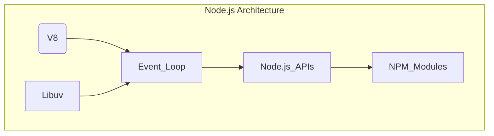

## Node.js
[Node.js](https://nodejs.org/en) is built on top of the [V8 JavaScript engine](https://v8.dev/), which is responsible for executing JavaScript code. However, Node.js extends the functionality of the V8 engine by providing APIs for I/O, `networking`, and other `system operations`. [Libuv](https://docs.libuv.org/en/v1.x/) plays a crucial role in this extension by powering the `event loop` and handling asynchronous I/O operations.

### V8
V8 is Google’s open source high-performance JavaScript `engine`, written in `C++`. It is used in Chrome and in Node.js, among others.

V8 implements [ECMAScript](https://tc39.es/ecma262/), providing all the data types, operators, objects and functions specified in the ECMA standard.

V8 `compiles` and `executes` JavaScript source code, handles memory allocation for objects, and garbage collects objects it no longer needs.

V8 enables any `C++` application to expose its own objects and functions to JavaScript code.

### Libuv
Libuv is a multi-platform C library that provides support for asynchronous I/O based on `event loops`. It was initially developed for Node.js to handle the event-driven architecture, but it has since been adopted by other projects due to its performance and efficiency. Libuv's primary features include:
- Event loop 
- Asynchronous file and file system operations 
- Asynchronous TCP and UDP sockets 
- Child processes
- Thread pool 
- Timers, signals, and polls

By handling all these features, libuv enables Node.js to work as a single-threaded, non-blocking, and event-driven platform.

### Event loop
Event loop has one very simple job: it looks at the stack, it looks at the task queue. If the stack is empty, it takes the first thing on the queue and push it on the stack.

single threaded runtime, has a single call stack, it can do one thing at the time, it can run one piece of code at the time

https://codedamn.com/news/nodejs/libuv-architecture

Callbacks are functions that are passed as arguments to other functions
