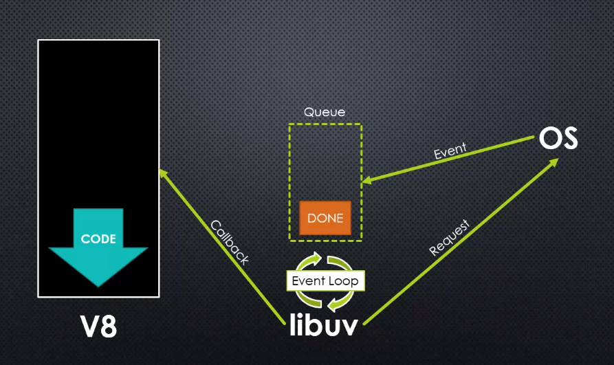
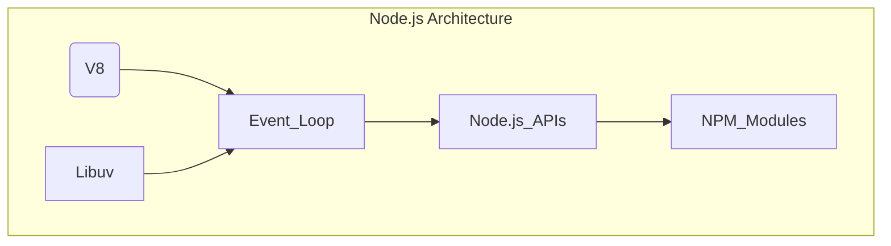

## Node.js
[Node.js](https://nodejs.org/en) is an open-source and cross-platform JavaScript runtime environment.

 It's built on top of the [V8](https://v8.dev/) engine, which is responsible for executing JavaScript code. However, Node.js extends the functionality of the V8 engine by providing APIs for I/O, `networking`, and other `system operations`. [Libuv](https://docs.libuv.org/en/v1.x/) plays a crucial role in this extension by powering the `event loop` and handling asynchronous I/O operations.

### V8
V8 is Google’s open source high-performance JavaScript `engine`, written in `C++`. It is used in Chrome and in Node.js, among others.

V8 implements [ECMAScript](https://tc39.es/ecma262/) specifications, providing all the data types, operators, objects and functions specified in the ECMA standard.

V8 `parses`,  `compiles` and `executes` JavaScript source code, handles memory allocation for objects, and garbage collects objects it no longer needs.

V8 enables any `C++` application to expose its own objects and functions to JavaScript code.

`Compilation`: JavaScript is generally considered an `interpreted` language, but modern JavaScript engines no longer just interpret JavaScript, they compile it. JavaScript is internally `compiled` by V8 with `just-in-time (JIT)` compilation to speed up the execution.

### Libuv
Libuv is a multi-platform `C` library that provides support for asynchronous I/O based on `event loops`.

It `implements all of the asynchronous behaviors of the platform`.

It was initially developed for Node.js to handle the event-driven architecture, but it has since been adopted by other projects due to its performance and efficiency. Libuv's primary features include:
- Event loop 
- Asynchronous file and file system operations 
- Asynchronous TCP and UDP sockets 
- Child processes
- Thread pool (4 threads by default)
- Timers, signals, and polls

Libuv API `essential concepts` [see here](https://tech.jotform.com/unraveling-the-javascript-execution-pipeline-understanding-v8-event-loop-and-libuv-for-4da6789fcfc2):
- `Handles`: These represent long-lived objects such as timers, signals, and TCP/UDP sockets. Once a task is completed, handles will trigger the appropriate `callbacks`. The `event loop` will `keep running` as long as a handle remains active
- `Requests`: Represent short-lived operations, such as reading from or writing to a file or establishing network connection. Like handles, `active requests will keep the event loop alive`
- `Thread pool`: Libuv assigns all the heavy work to a pool of worker threads (`UV_THREADPOOL_SIZE`= 4, by default). This thread pool is responsible for handling tasks like `file I/O` and `DNS lookup`

### Event loop
The Event loop is what allows Node.js to perform non-blocking I/O operations — despite the fact that `JavaScript (V8) is single-threaded` — by offloading operations to the system kernel whenever possible.

Since most `modern kernels are multi-threaded`, they can handle multiple operations executing in the background. When one of these operations completes, the kernel tells Node.js so that the appropriate `callback` may be added to the poll `queue` to eventually be executed.

The Event loop is `semi-infinite` loop: it's considered alive if there are active handles or requests. If there are no active tasks, the loop will end.

In practice, Event loop has one very simple job: it looks at the stack, it looks at the task queue. If the stack is empty, it takes the first thing on the queue and push it on the stack.

#### Transferring outcomes from `Libuv` to `V8`
Once `libuv` finishes executing the asynchronous function, it adds the corresponding `callback` to the `task queue(s)` (`FIFO` first-in, first-out). The `event loop`, responsible for managing the execution flow, if the `call stack is empty`, retrieves an event from the `task queue` and pushes it onto the `call stack` (LIFO, last-in, first-out). This allows `V8` to effectively manage and handle asynchronous operations `without blocking the main thread`.

---

Online JS internals visualizers: [Loupe](http://latentflip.com/loupe/) and [Jsv](https://www.jsv9000.app/)

single threaded runtime, has a single call stack, it can do one thing at the time, it can run one piece of code at the time

https://codedamn.com/news/nodejs/libuv-architecture

Callbacks are functions that are passed as arguments to other functions

https://tech.jotform.com/unraveling-the-javascript-execution-pipeline-understanding-v8-event-loop-and-libuv-for-4da6789fcfc2
